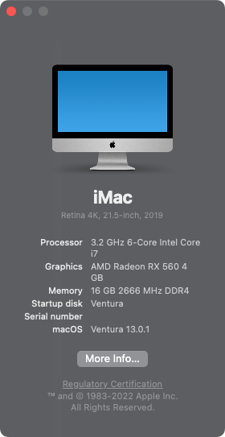

## HP Pavilion Desktop 590 i7-8700 Hackintosh OpenCore EFI

### [简体中文](README.zh_CN.md)

### Spec

- Chipset: Intel H370
- CPU: Intel 8th i7-8700
- Memo: Samsung 16GB(2x8GB) DDR4 2666 Mhz
- GPU: AMD Radeon RX 560 4GB
- HDA: Realtek ALC671
- SSD: WD SN550 1TB
- LAN: Realtek RTL8111
- WLAN: BCM94360CS2

### OpenCore

[OpenCore 0.9.6](https://github.com/acidanthera/OpenCorePkg)

### Screenshot

### Kexts

- [Lilu.kext 1.6.7](https://github.com/acidanthera/Lilu)
- [SMCProcessor.kext 1.3.2](https://github.com/acidanthera/VirtualSMC)
- [SMCSuperIO.kext 1.3.2](https://github.com/acidanthera/VirtualSMC)
- [VirtualSMC.kext 1.3.2](https://github.com/acidanthera/VirtualSMC)
- [WhateverGreen.kext 1.6.6](https://github.com/acidanthera/WhateverGreen)
- [NVMeFix.kext 1.1.1](https://github.com/acidanthera/NVMeFix)
- [AppleALC.kext 1.8.7](https://github.com/acidanthera/AppleALC)
- [IntelMausi.kext 1.0.7](https://github.com/acidanthera/IntelMausi)
- [RadeonSensor.kext 0.3.3](https://github.com/aluveitie/RadeonSensor)
- [SMCRadeonGPU.kext 0.3.3](https://github.com/aluveitie/RadeonSensor)

### Tools

- [Hackintool](https://github.com/headkaze/Hackintool) 
- [OCAuxiliaryTools](https://github.com/ic005k/OCAuxiliaryTools) AKA `OCAT`.
- [OpenCore Configurator](https://mackie100projects.altervista.org/opencore-configurator/) AKA `OCC`.
- [GenSMBIOS](https://github.com/corpnewt/GenSMBIOS) Generate SMBIOS.
- [MountEFI](https://github.com/corpnewt/MountEFI) Mount EFI partition.
- [EFI Agent](https://github.com/headkaze/EFI-Agent) Better EFI partition mount App.
- [gibMacOS](https://github.com/corpnewt/gibMacOS) Build your own MacOS image.
- [ProperTree](https://github.com/corpnewt/ProperTree) Plist editor.
