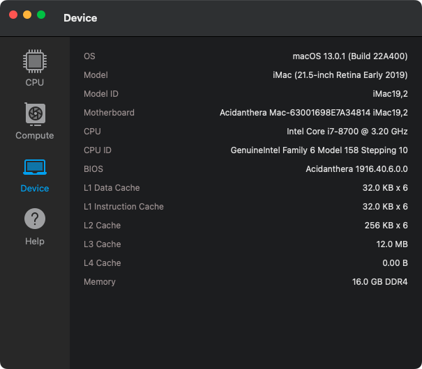

## HP Pavilion Desktop 590 i7-8700 Hackintosh OpenCore EFI

### [简体中文](README.zh_CN.md)

### Screenshot

### OpenCore

[OpenCore 0.8.7](https://github.com/acidanthera/OpenCorePkg)

### Kexts

- [Lilu.kext 1.6.2](https://github.com/acidanthera/Lilu)
- [SMCProcessor.kext 1.3.0](https://github.com/acidanthera/VirtualSMC)
- [SMCSuperIO.kext 1.3.0](https://github.com/acidanthera/VirtualSMC)
- [VirtualSMC.kext 1.3.0](https://github.com/acidanthera/VirtualSMC)
- [WhateverGreen.kext 1.6.2](https://github.com/acidanthera/WhateverGreen)
- [NVMeFix.kext 1.1.0](https://github.com/acidanthera/NVMeFix)
- [AppleALC.kext 1.7.7](https://github.com/acidanthera/AppleALC)
- [IntelMausi.kext 1.0.7](https://github.com/acidanthera/IntelMausi)
- [USBMap.kext v1.0](https://github.com/corpnewt/USBMap)
- [EFICheckDisabler.kext v1.0.0](https://github.com/w19996/EFICheckDisabler)

### Tools

- [Hackintool](https://github.com/headkaze/Hackintool) 
- [OpenCore Configurator](https://mackie100projects.altervista.org/opencore-configurator/) AKA OCC.
- [GenSMBIOS](https://github.com/corpnewt/GenSMBIOS) Generate SMBIOS.
- [MountEFI](https://github.com/corpnewt/MountEFI) Mount EFI partition.
- [EFI Agent](https://github.com/headkaze/EFI-Agent) Better EFI partition mount App.
- [gibMacOS](https://github.com/corpnewt/gibMacOS) Build your own MacOS image.
- [ProperTree](https://github.com/corpnewt/ProperTree) Plist editor.
