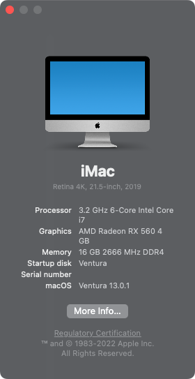
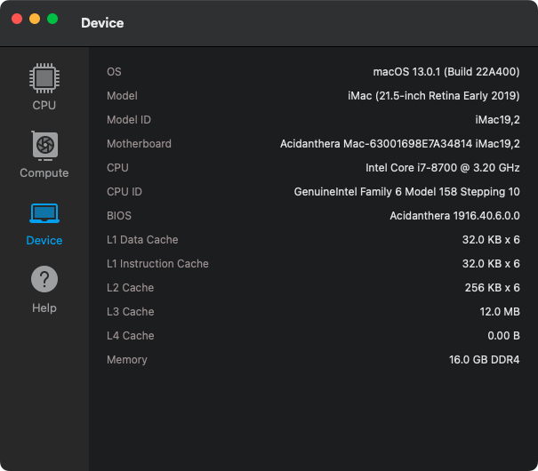

## HP Pavilion Desktop 590 i7-8700 黑苹果 OpenCore EFI

### [English](README.md)

### 机器配置

- 主板: Intel H370
- 处理器: Intel 八代 i7-8700
- 内存: 三星 16GB(2x8GB) DDR4 2666 Mhz
- 显卡: AMD Radeon RX 560 4GB
- 声卡: Realtek ALC623
- 硬盘: 西数蓝盘 SN550 1TB
- 网卡: Realtek RTL8111
- 无线: BCM94360CS2（白果拆机卡）

### OpenCore

[OpenCore 0.9.5](https://github.com/acidanthera/OpenCorePkg)

### 系统截图

### Kexts

- [Lilu.kext 1.6.7](https://github.com/acidanthera/Lilu)
- [SMCProcessor.kext 1.3.2](https://github.com/acidanthera/VirtualSMC)
- [SMCSuperIO.kext 1.3.2](https://github.com/acidanthera/VirtualSMC)
- [VirtualSMC.kext 1.3.2](https://github.com/acidanthera/VirtualSMC)
- [WhateverGreen.kext 1.6.6](https://github.com/acidanthera/WhateverGreen)
- [NVMeFix.kext 1.1.1](https://github.com/acidanthera/NVMeFix)
- [AppleALC.kext 1.8.5](https://github.com/acidanthera/AppleALC)
- [IntelMausi.kext 1.0.7](https://github.com/acidanthera/IntelMausi)
- [RadeonSensor.kext 0.3.3](https://github.com/aluveitie/RadeonSensor)
- [SMCRadeonGPU.kext 0.3.3](https://github.com/aluveitie/RadeonSensor)

### 工具

- [Hackintool](https://github.com/headkaze/Hackintool) 
- [OCAuxiliaryTools](https://github.com/ic005k/OCAuxiliaryTools) 即 `OCAT`.
- [OpenCore Configurator](https://mackie100projects.altervista.org/opencore-configurator/) 即 `OCC`。
- [GenSMBIOS](https://github.com/corpnewt/GenSMBIOS) 三码生成工具。
- [MountEFI](https://github.com/corpnewt/MountEFI) EFI 分区挂载工具。
- [EFI Agent](https://github.com/headkaze/EFI-Agent) 更方便的EFI分区挂载工具。
- [gibMacOS](https://github.com/corpnewt/gibMacOS) macOS 官方镜像下载工具。
- [ProperTree](https://github.com/corpnewt/ProperTree) Plist 编辑器。
